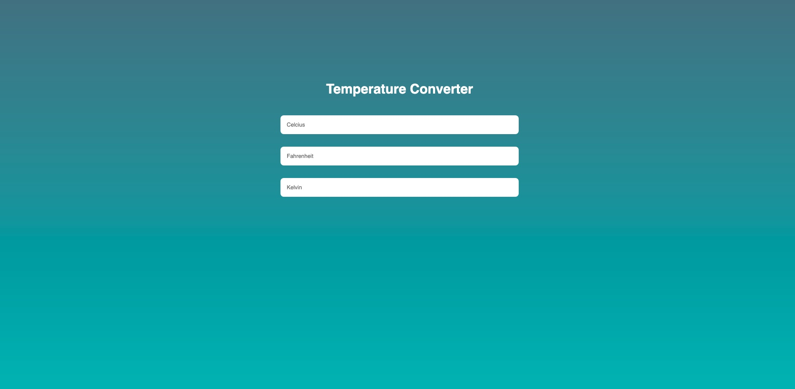

# JavaScript-app-temperature-converter

A simple JavaScript app, used to convert temperature.

Temperature includes: Celcius, Fahrenheit, Kelvin

Deployed live at https://maxly-webapp-tempconverter.netlify.app

